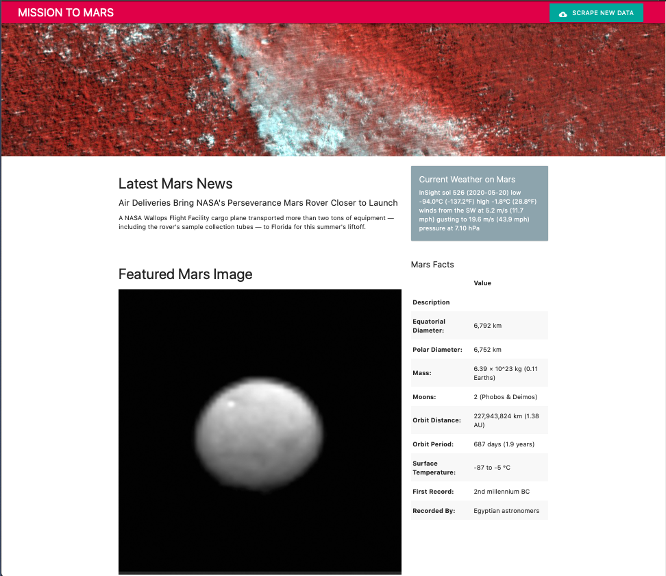
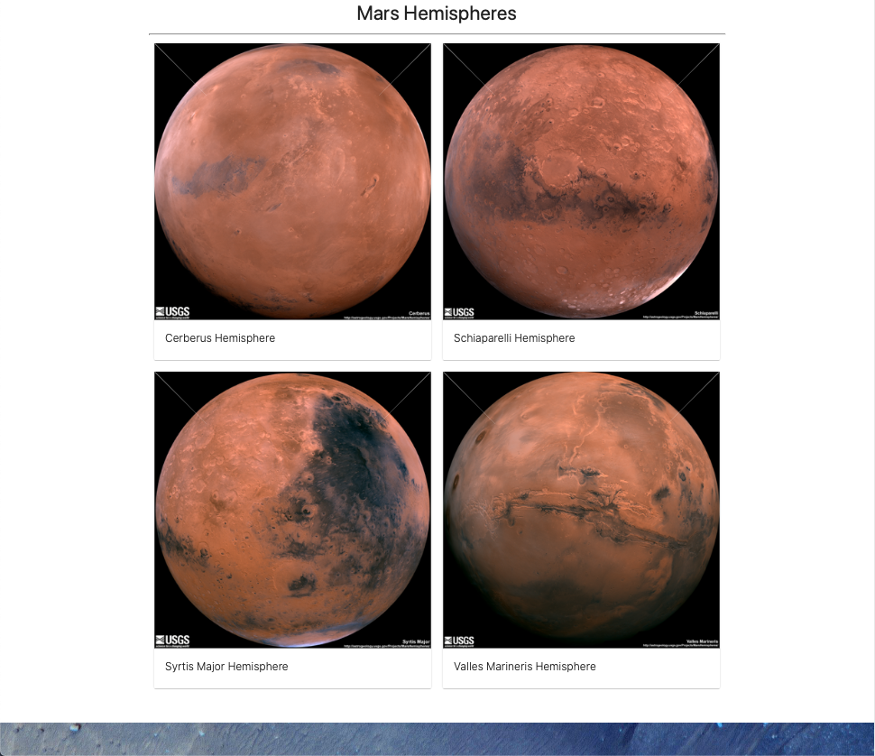
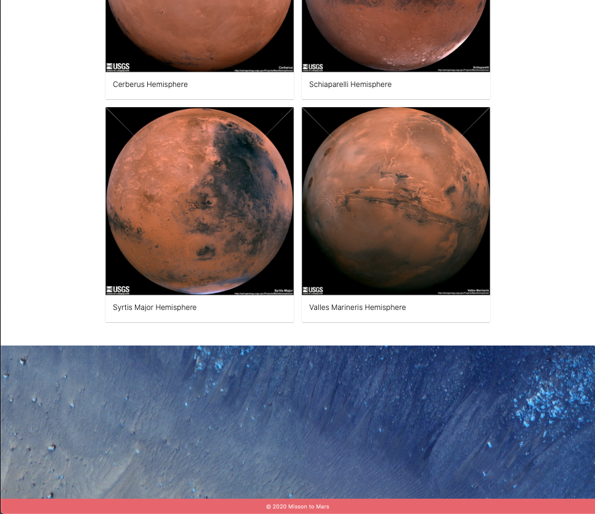

# Misson to Mars

## Background

This is a web application that scrapes various websites for data related to the Mission to Mars and displays the information in a single HTML page.

## Resources
Web scraping of these websites generates the data for this dashboard.

### NASA Mars News

* Scrape the latest News Title and Text from [NASA Mars News Site](https://mars.nasa.gov/news/).

### JPL Mars Space Images - Featured Image

* Scrape the the current fullsize Featured Mars Image from [JPL Featured Space Image](https://www.jpl.nasa.gov/spaceimages/?search=&category=Mars).

### Mars Weather

* Scrape the latest Mars weather tweet from the [Mars Weather twitter account](https://twitter.com/marswxreport?lang=en)

### Mars Facts

* Scrape the table containing facts about the planet including Diameter, Mass, etc. from the [Mars Facts webpage](https://space-facts.com/mars/)

### Mars Hemispheres

* Scrape high resolution image URLs for each of Mar's hemispheres from the [USGS Astrogeology site](https://astrogeology.usgs.gov/search/results?q=hemisphere+enhanced&k1=target&v1=Mars).

## Dashboard Page

The dashboard was created using [MaterializeCSS](https://materializecss.com), [D3.js](https://d3js.org), [Flask](https://flask.palletsprojects.com), and [MongoDB](https://www.mongodb.com).

----
### Copyright

© 2020. All Rights Reserved.
